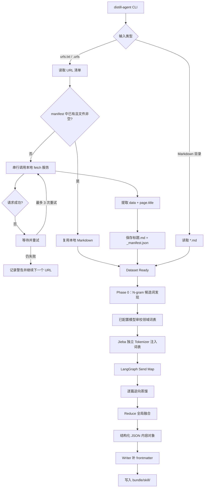
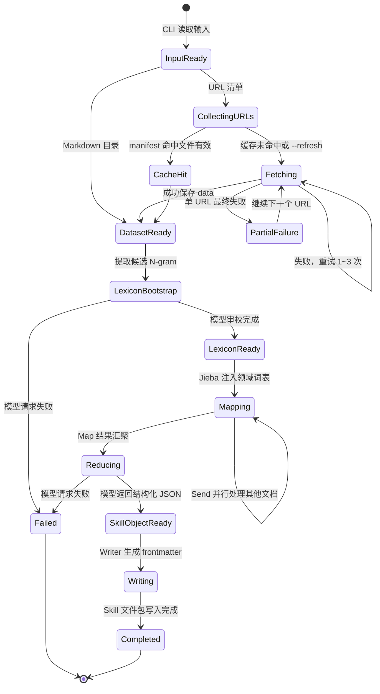
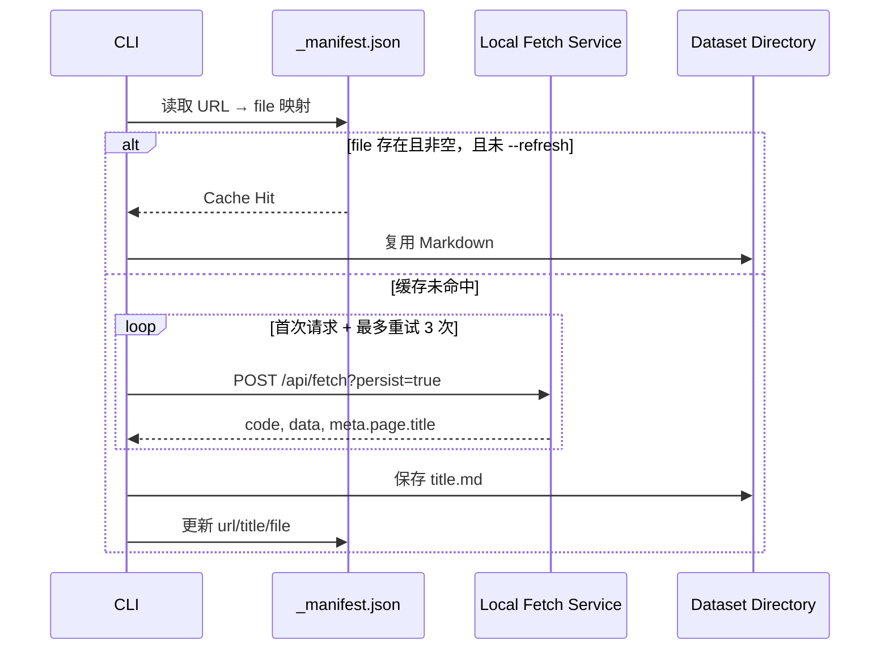

# 多文档 Skill 蒸馏 Agent：系统流程与状态

本文档描述当前代码已经实现的流程，并单独列出尚未实现的能力。

每个输入对应一个可复用的 `runs/<input-slug>-<input-hash>/` bundle，采集资料位于 `sources/`，蒸馏过程数据位于 `process/`，最终 Skill 位于 `skill/`。同一输入再次运行会复用有效采集缓存并重新生成蒸馏结果；整个 bundle 可直接打包归档。

## 1. 总体流程



`_manifest.json` 是网页抓取缓存，只负责避免重复下载，不会影响领域词库。

## 2. LangGraph 状态图



## 3. URL 采集状态



## 4. 当前完成度

### 已实现

- CLI 参数解析与 `--dry-run`
- Markdown 目录输入
- URL 清单输入
- 串行采集、缓存复用、`--refresh`
- 单 URL 最多重试 3 次
- `data`、`meta.page.title` 和 `_manifest.json` 持久化
- N-gram 候选词发现
- 已配置模型动态领域词表审校
- Jieba 独立词典注入
- 每次从当前完整资料重新构建领域词库，不跨运行累积
- `_manifest.json` 默认复用；领域词库写入本次 bundle 的 `process/domain_dictionary.json`
- LangGraph `Send` Map-Reduce
- JSON mode、`max_tokens`、`reasoning_effort`
- Skill frontmatter、`skill.json` 与九类基础 reference 输出，包含内容/风格分层、标题体系、反 AI 味和协作 SOP；`narrative` Profile 额外输出七维叙事风格 reference

### 尚待补齐

- 单次运行的 checkpoint / resume
- LLM 请求缓存，避免重复蒸馏同一批材料
- token、耗时、费用统计
- Skill 生成后的自动质量评分
- 增量蒸馏与新旧 Skill diff
- 失败任务的持久化状态和可重跑队列
- Few-Shot 生成结果的自动回测闭环
- 文件级读写工具注册。目前文件读写由 Python `Path` 完成，不是 LangChain Tool。

## 5. 关键边界

```text
外层模型响应：JSON —— 供 Python / LangGraph 解析
Skill.md 内容：Markdown —— 供最终写作 Agent 使用
```

两者必须保持隔离。最终生成的政策材料应是 Markdown/纯文本正文，不应继承 `response_format=json_object`、`reasoning_effort` 或内部通信协议。
